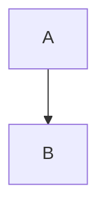

# waleed.de - Personal Website & Blog

A high-performance, technically sophisticated personal website built with modern web technologies. The site prioritizes maintainability, performance, and longevity through careful technical choices.

## Tech Stack

- **Framework**: [Astro](https://astro.build/) - Static site generator with excellent performance characteristics
- **UI Components**: [React](https://react.dev/) - For interactive components
- **Styling**: [Tailwind CSS](https://tailwindcss.com/) - Utility-first CSS framework
- **Content**: MDX with custom plugins for enhanced markdown features
- **Interactive Elements**: Animations with canvas-confetti
- **Performance Optimizations**:
  - Font optimization with Fontaine
  - Image optimization with Sharp
  - View Transitions API support
  - Efficient asset bundling

## Project Structure

```
blog/
├── src/
│   ├── components/     # React components
│   ├── content/       # MDX blog posts
│   ├── layouts/       # Page layouts
│   ├── styles/        # Global styles and Tailwind config
│   └── lib/          # Utility functions and constants
├── public/           # Static assets
└── tests/           # Vitest test suites
```

## Key Features

- **Performance First**

  - Zero client-side JavaScript by default (islands architecture)
  - Optimal asset loading and caching strategies
  - Core Web Vitals optimization

- **Content Management**

  - MDX support with custom components
  - Math equations via remark-math
  - Diagrams with Mermaid.js
  - Automatic table of contents generation
  - Reading time estimation

- **Music Integration**

  - Last.fm API integration
  - Real-time "Now Playing" status
  - Music listening statistics
  - Weekly and monthly listening reports
  - Favorite artists and tracks display

- **Interactive Elements**
  - Canvas confetti animation with basic cannon effect
  - Client list display in single column layout
  - Command palette for quick navigation
  - Theme switching functionality

- **Developer Experience**
  - TypeScript for type safety
  - ESLint with @antfu/eslint-config
  - Vitest for unit testing
  - Playwright for E2E testing

## Build and Deploy

```bash
# Install dependencies
pnpm install

# Development
pnpm run dev

# Build
pnpm run build

# Preview production build
pnpm run preview

# Run tests
pnpm run test
```

## Content Authoring

Blog posts are written in MDX and support:

- Custom Vue components
- Mathematical equations (LaTeX syntax)
- Code syntax highlighting with Shiki
- Embedded tweets
- Automatic image optimization

Example MDX post:

````mdx
---
title: Example Post
date: 2024-03-21
description: An example blog post
---

import MyComponent from "@/components/MyComponent.vue";

# {frontmatter.title}

<MyComponent />

## Math Example

$E = mc^2$

## Diagram Example


````

## Performance Optimizations

- View Transitions API for smooth page navigation
- Automatic font optimization with Fontaine
- Image processing with Sharp
- Critical CSS extraction
- Asset optimization and minification
- SEO optimizations and meta tags
- Open Graph images generation

## License

This project is licensed under the [MIT license](./LICENSE)
