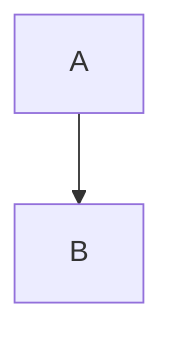

# waleed.de - Personal Website & Blog

A high-performance, technically sophisticated personal website built with modern web technologies. The site prioritizes maintainability, performance, and longevity through careful technical choices.

## Tech Stack

- **Framework**: [Astro](https://astro.build/) - Static site generator with excellent performance characteristics
- **UI Components**: [Vue 3](https://vuejs.org/) - For interactive components
- **Styling**: [UnoCSS](https://unocss.dev/) - Atomic CSS engine
- **Content**: MDX with custom plugins for enhanced markdown features
- **Performance Optimizations**:
  - Font optimization with astro-font
  - Image optimization with @unpic/astro
  - Subfont generation for minimal font loading
  - Aggressive asset optimization

## Project Structure

```
blog/
├── src/
│   ├── components/     # Vue and Astro components
│   │   ├── vue/       # Interactive Vue components
│   │   └── astro/     # Static Astro components
│   ├── content/       # MDX blog posts and pages
│   │   ├── blog/      # Blog posts
│   │   └── pages/     # Static pages
│   ├── layouts/       # Page layouts and templates
│   ├── styles/        # Global styles and UnoCSS config
│   └── utils/         # Utility functions and helpers
├── public/           # Static assets
├── scripts/          # Build and utility scripts
└── tests/           # Test suites
```

## Key Features

- **Performance First**
  - Zero client-side JavaScript by default (islands architecture)
  - Optimal asset loading and caching strategies
  - Core Web Vitals optimization

- **Content Management**
  - MDX support with custom components
  - Math equations via remark-math
  - Diagrams with Mermaid.js
  - Automatic table of contents generation
  - Reading time estimation

- **Developer Experience**
  - TypeScript for type safety
  - ESLint with @antfu/eslint-config
  - Vitest for unit testing
  - Playwright for E2E testing

## Build and Deploy

```bash
# Install dependencies
pnpm install

# Development
pnpm dev

# Build
pnpm build

# Preview production build
pnpm preview

# Run tests
pnpm test

# Lint
pnpm lint
```

## Content Authoring

Blog posts are written in MDX and support:
- Custom Vue components
- Mathematical equations (LaTeX syntax)
- Code syntax highlighting with Shiki
- Embedded tweets
- Automatic image optimization

Example MDX post:
```mdx
---
title: Example Post
date: 2024-03-21
description: An example blog post
---

import MyComponent from '@/components/MyComponent.vue'

# {frontmatter.title}

<MyComponent />

## Math Example
$E = mc^2$

## Diagram Example

```

## Performance Optimizations

- Automatic font subsetting
- Responsive image processing
- Critical CSS extraction
- Aggressive asset minification
- Sitemap generation
- RSS feed generation

## License
This project is licensed under the [MIT license](./LICENSE)
